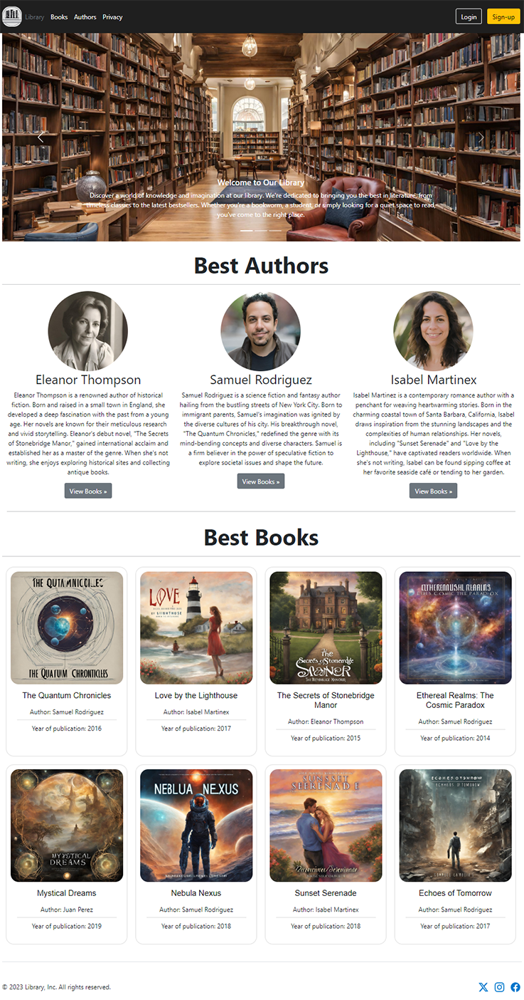
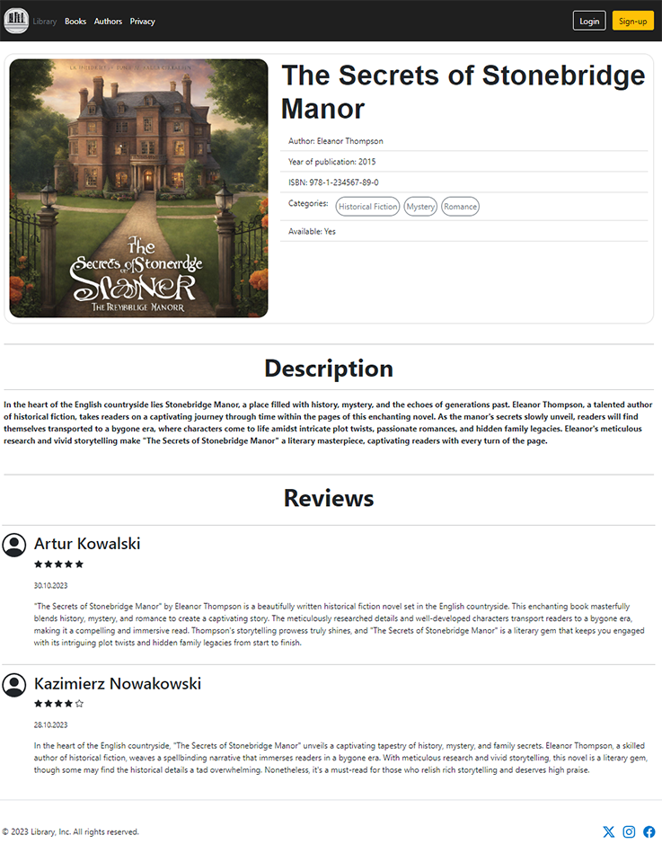
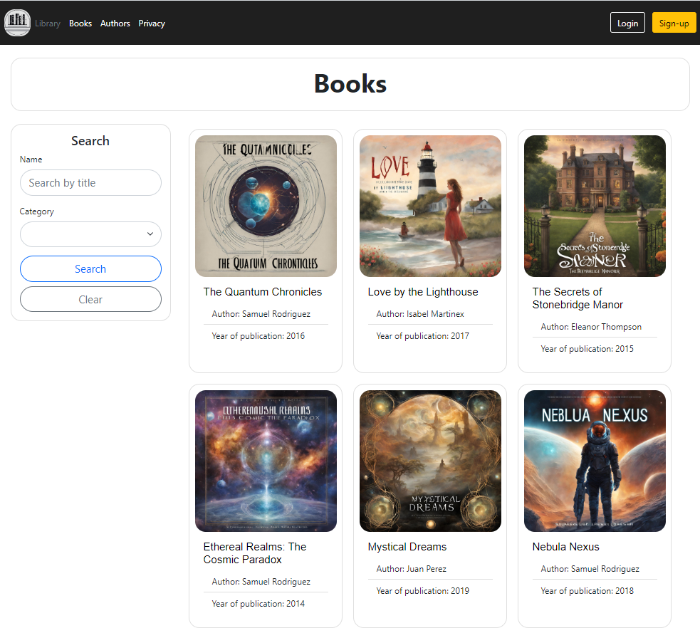

# Library Management System

The Library Management System is a web application developed using ASP.NET Core. It allows users to explore, review, and borrow books from the library. Key features include:

  <ul>
    <li><strong>Browse Books:</strong> Users can search and explore available books by titles, authors, and categories.</li>
    <li><strong>Book Reviews:</strong> Each book has a dedicated section for reviews and ratings, enabling users to share their opinions.</li>
    <li><strong>Book Borrowing:</strong> Registered users can borrow books, and the system keeps track of borrowing dates.</li>
    <li><strong>Category Management:</strong> Administrators can add and list book categories, facilitating library organization.</li>
    <li><strong>User Account:</strong> Each user has a personalized account to manage borrowings and review history.</li>
    <li><strong>User Roles:</strong> The application supports different user roles, ensuring access control and permissions.</li>
  </ul>

  # Microsoft Azure Deployment
  
The application is hosted on Microsoft Azure, ensuring reliable and scalable performance. Due to the nature of free hosting, initial loading may take some time. If an error occurs during the first load, please wait for the system to establish a connection with the database and refresh the page

  
Visit the deployed application at: https://libraryonlineproject.azurewebsites.net/

  # Technologies Used

  <ul>
    <li><strong>ASP.NET Core:</strong> Framework for building modern, cloud-based, and internet-connected applications.</li>
    <li><strong>Razor Pages:</strong> Allows for the creation of interactive user interfaces with both view and code in a single file.</li>
    <li><strong>Bootstrap:</strong> Front-end framework for building responsive and visually appealing web pages.</li>
    <li><strong>Cloudinary:</strong> Cloud service for efficient management of book cover images.</li>
    <li><strong>Entity Framework Core:</strong> Object-relational mapping framework for efficient data access and database management.</li>
    <li><strong>PostgreSQL:</strong> Relational database management system for storing user, book, and system data.</li>
  </ul>

  # Functionality

  <ol type="1">
    <li><strong>Unregistered user:</strong>
        <ul>
            <li>Possibility to create account</li>
            <li>Browse Books</li>
            <li>Browse Authors</li>
            <li>See Book Reviews</li>
        </ul>
    </li>
    <li>
        <strong>Registered user:</strong>
        <ul>
            <li>Browse Books</li>
            <li>Browse Authors</li>
            <li>See Book Reviews</li>
            <li>Possibility to loan the book (every book can be loaned only once)</li>
            <li>Possibility to write a review and edit it later</li>
        </ul>
    </li>
    <li>
        <strong>Admin:</strong>
        <ul>
            <li>Browse Books</li>
            <li>Browse Authors</li>
            <li>See Book Reviews</li>
            <li>Add Books, Authors and Book Categories</li>
            <li>See Categories</li>
        </ul>
    </li>
</ol>

# Screenshots

<ul>
  <li>Main View</li>
   
  
  <li>Book Description and Reviews View</li>
   
    
  <li>Books View</li>
   
    
     

</ul>
